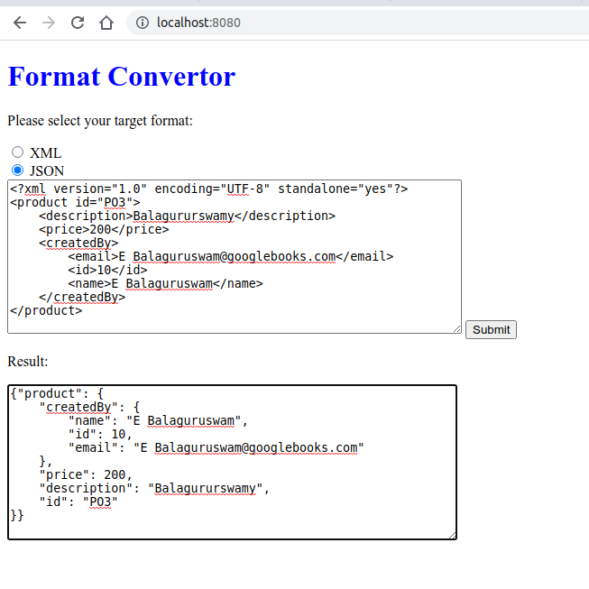
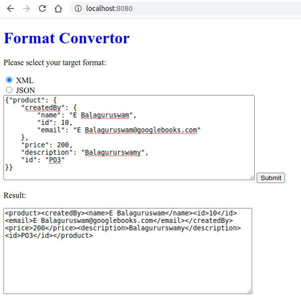
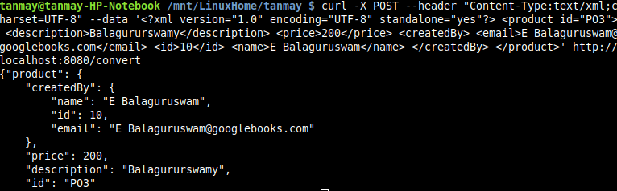
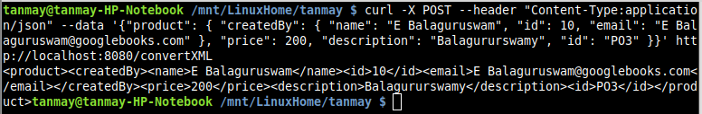

## Format Convertor Application

This is a simple SpringBoot Application to convert from XML to JSON and vice-versa.

* Written in **SpringBoot** (v4.2) and provides REST API for integration with other applicaitons.

* Unlike traditional parsers like SAX Parsers, this application is not bound to any Model Object.
* This makes it very flexible to convert any XML into JSON object and conversely any JSON into XML format.
* It uses Thymeleaf to provide GUI interface.

###Usages
1. Browser : http://localhost:8080
2. Using cURL (on Unix Systems)
3. Read from files (Refer Test case-UtilTest for example)

###Browser Example
####Convert XML to JSON

####Convert JSON to XML:

###cURL
####Convert XML to JSON
`curl -X POST  --header "Content-Type:text/xml;charset=UTF-8"  --data '<?xml version="1.0" encoding="UTF-8" standalone="yes"?>
<product id="PO3">
    <description>Balagururswamy</description>
    <price>200</price>
    <createdBy>
        <email>E Balaguruswam@googlebooks.com</email>
        <id>10</id>
        <name>E Balaguruswam</name>
    </createdBy>
</product>' http://localhost:8080/convert`

Output:

####Convert JSON to XML:
Run this command:

`curl -X POST  --header "Content-Type:application/json"  --data '{"product": {
    "createdBy": {
        "name": "E Balaguruswam",
        "id": 10,
        "email": "E Balaguruswam@googlebooks.com"
    },
    "price": 200,
    "description": "Balagururswamy",
    "id": "PO3"
}}' http://localhost:8080/convertXML`

Output:
